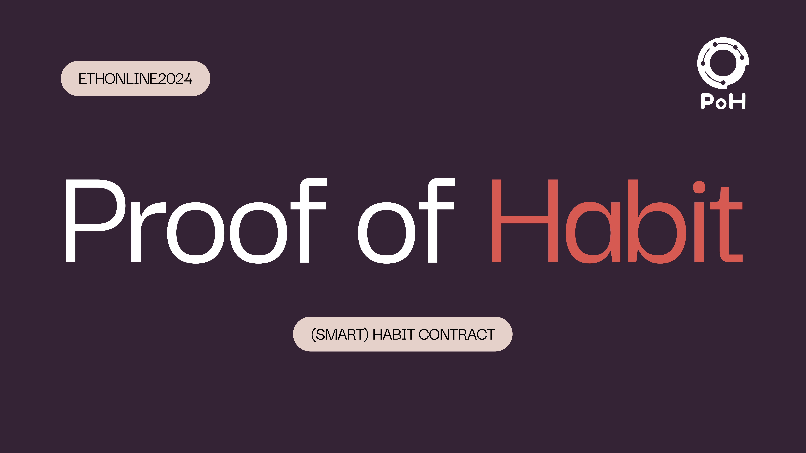
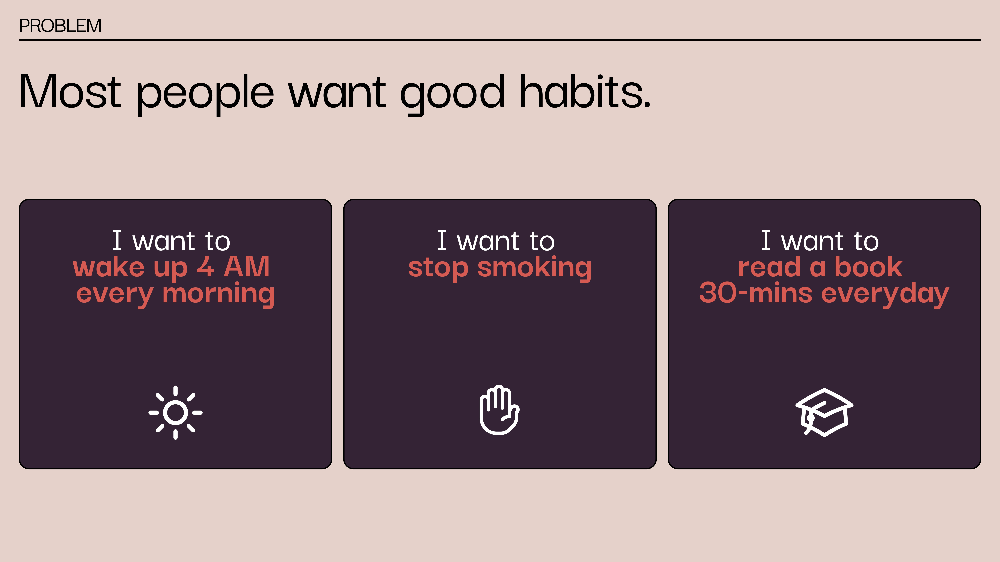
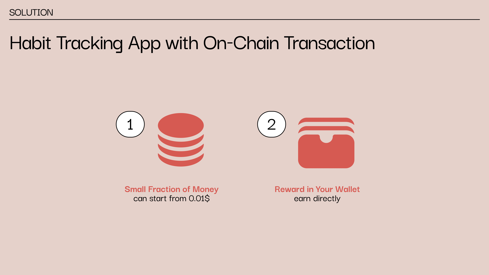
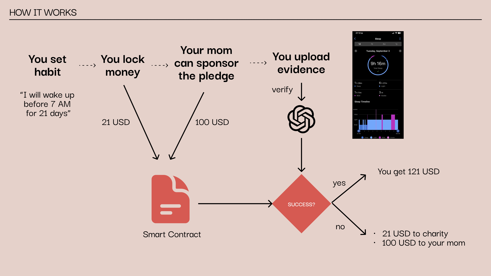

     

> Try our product: [here](https://proofofhabit.up.railway.app/)

# Proof of Habit
Developed for ETHOnline 2024

Proof of Habit addresses the universal challenge of habit formation by combining behavioral economics, social psychology, and blockchain technology. By creating a system where users have "skin in the game" and can receive support from their community, we increase the likelihood of successful habit adoption.

Our use of AI for verification adds a layer of accountability while maintaining user privacy and reducing the need for manual checks. The integration with blockchain technology ensures that all transactions and commitments are transparent and tamper-proof.

     

### Key Features:

     

1. **Blockchain-Backed Commitments**: Users create habit pledges on the Ethereum blockchain, ensuring transparency and immutability of their commitments.

2. **Financial Incentives**: Participants stake cryptocurrency as a self-imposed penalty for failing to meet their habit goals, creating a powerful motivator for success.

3. **Social Sponsorship**: Friends and supporters can sponsor a user's habit journey, adding additional rewards and encouragement.

4. **AI-Powered Verification**: Daily progress is verified using ChatGPT-4o, which analyzes photo evidence submitted by users to confirm habit completion. This enables a scalable and cost-effective verification process.

### Technology Stack:

- **Smart Contracts**: Solidity, Foundry
- **Blockchain Interaction**: Ethers.js
- **Authentication**: Sign-in with Ethereum (SIWE) by WalletConnect
- **Frontend**: Next.js
- **Backend**: Node.js
- **Database**: Prisma
- **Verification AI**: ChatGPT-4o

## How It Works

     

1. **Sign In with Ethereum**: Connect your wallet and sign to authenticate.

2. **Create Your Habit Challenge**:
   - Define the habit you want to build
   - Set the duration (number of days)
   - Choose your stake amount (penalty for failure)

3. **Invite Sponsors**: Share a unique link with friends to sponsor your habit journey.

4. **Daily Verification**:
   - Submit photo evidence of your habit completion each day
   - Our AI-powered system (ChatGPT-4o) verifies your progress

5. **Consequences**:
   - Success: Reclaim your stake plus any sponsor rewards
   - Failure: Your stake is donated to charity
   - Partial Success: Get some portion of your stake back

By combining financial incentives, social support, and AI verification, Proof of Habit creates a powerful ecosystem for personal growth and habit formation.

# Challenges

**API Through Oracle**: At the end of the pledge, we need to send a number of successful days to the smart contract. Right now, we have no way to verify that users havn't cheated by calling smart contract function directly without our verification. We need some kind of oracle to verify the data for us.

## Project Structure
The project is split into 2 packages:

- `contract`: contains the smart contracts
- `web`: contains the frontend app including API to ChatGPT and database

### Deployed Contract Address
Morphl Holeskey Testnet
[0xCbdE51Ba4307742DF70afF96186801cA61f73b20](https://explorer-holesky.morphl2.io/address/0xCbdE51Ba4307742DF70afF96186801cA61f73b20)

### Future Developments:

- Integration with health and fitness tracking devices for automated progress monitoring.
- Expansion to support group challenges. To make it more fun and social!

Proof of Habit represents a novel approach to personal development, leveraging cutting-edge technology to empower individuals to take control of their habits and, by extension, their lives. Join us in revolutionizing the way people approach self-improvement and habit formation!
